# フロー図 — water_from_mountain

処理の流れを Mermaid 図で示します（GitHub 上でそのまま描画されます）。

## 1. モジュール構成

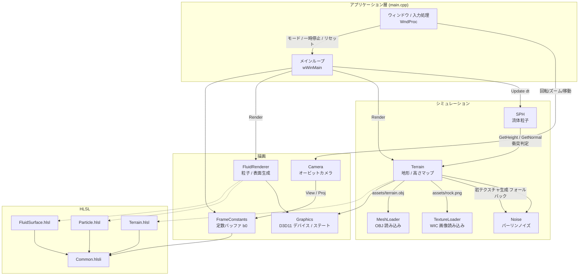

## 2. 起動から終了までの全体フロー

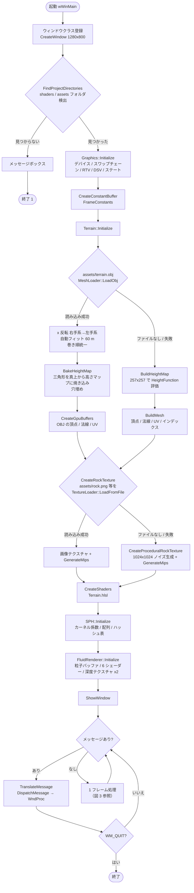

## 3. 1 フレームの処理

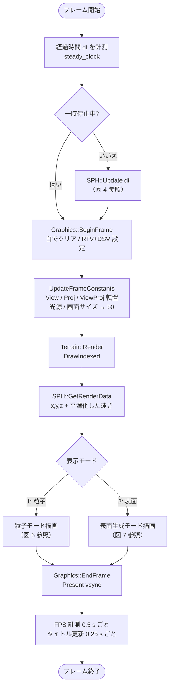

## 4. SPH::Update — サブステップ制御

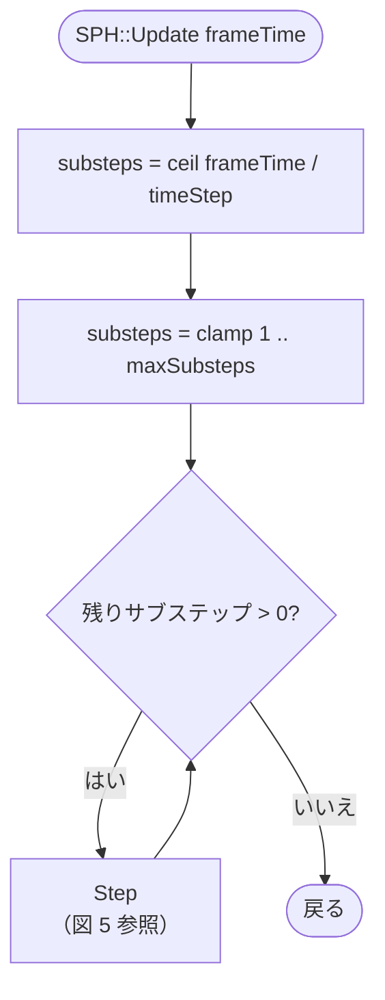

## 5. SPH::Step — 1 サブステップの物理計算

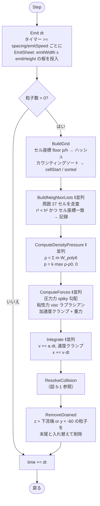

### 5-1. ResolveCollision — 粒子 1 個の境界処理

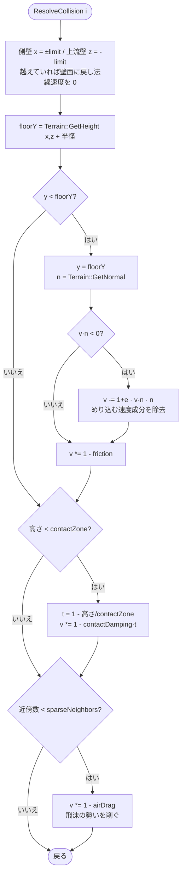

## 6. 粒子モード描画（FluidRenderer, mode = Particles）

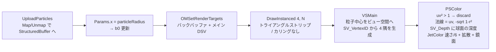

## 7. 表面生成モード描画（FluidRenderer, mode = Surface）

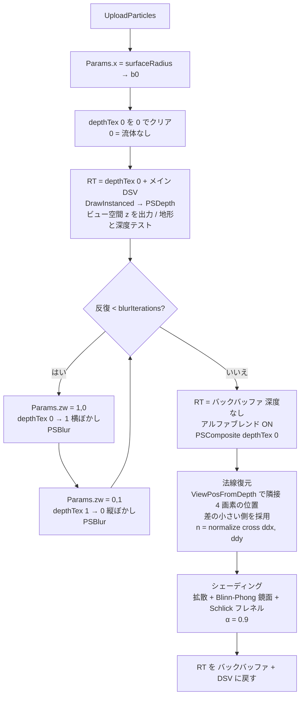

### 7-1. PSBlur — バイラテラルぼかし（1 画素）

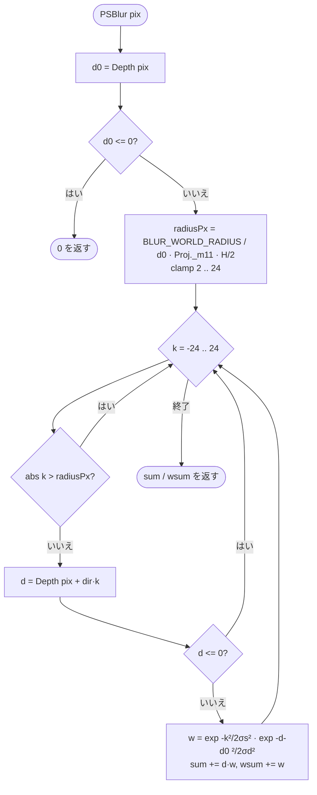

## 8. 入力イベント処理（WndProc）

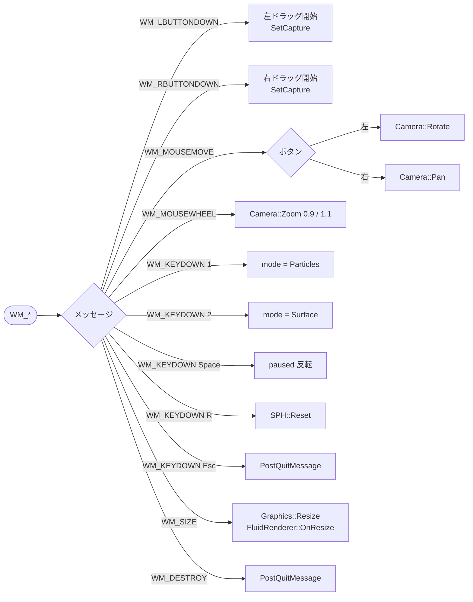

## 9. GPU リソースとデータの流れ

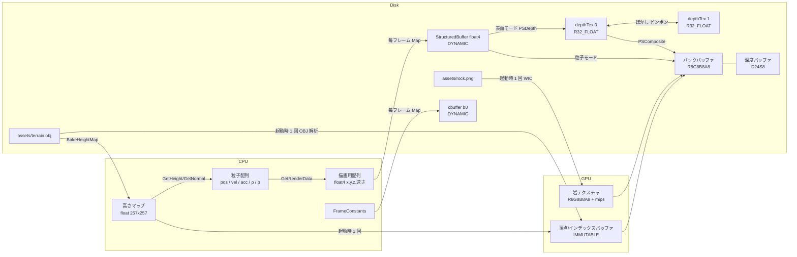
